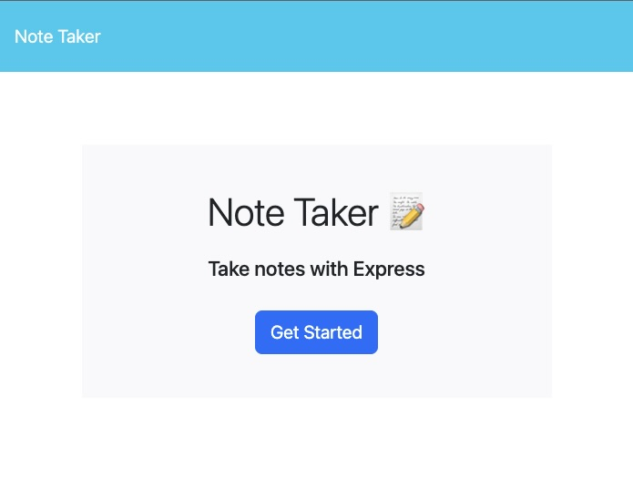

# Express.js Note Taker
 

## Description

This application is a simple note taker that uses express.js. Express.js is a node.js package that helps create custom API calls using HTTP methods. I learned how to develop modular routing and store persistent data using a json file. Insomnia was incredibly useful to test the GET, POST, and DELETE methods. I also learned how to deploy applications on Heroku.

## Table of Contents (Optional)

- [Usage](#usage)
- [Credits](#credits)
- [License](#license)

## Usage
Open the application hosted on Heroku which will take you to the landing page. Click on Get Started to begin entering your notes. Enter a note title, and the note text. Once you have entered your note text, a save button will appear on the top bar. Click save and the note will move to the left bar and you will be able to enter as many notes as you would like. Click on the delete icon next to each note to delete them from your saved notes. Follow this [link]() to visit the deployed application. 

.

## Credits
- Node.js
- Express, FS, and Util packages
- fsUtils.js and uuid.js files sourced from the University of Utah Coding Bootcamp
- Starter code and resources provided by the UofU Coding Bootcamp
- Google used as a resource to find the delete express method

## License
This project is licensed under the MIT license.

## How to Contribute

Please visit the [Contributor Covenant](https://www.contributor-covenant.org/)

  ## Questions

  If you have any questions, please contact me at evermuniz@outlook.com.
  You can also visit my GitHub profile [here](https://github.com/evermuniz/)